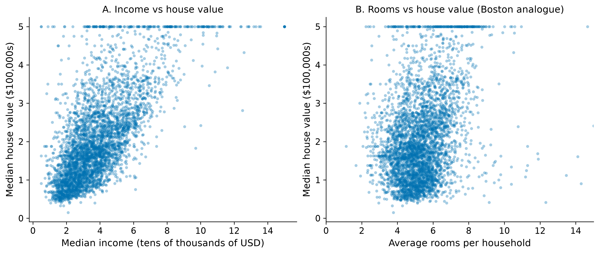
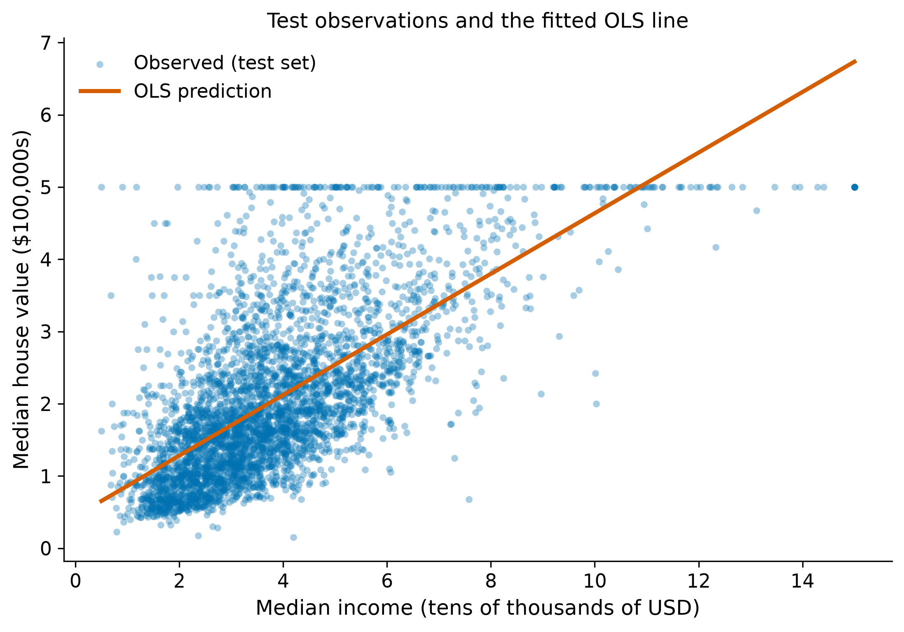

Student: Balaussa Ibrayeva

# 1. Task

Reproduce the supervised-learning example from the lecture on a dataset other than Boston Housing. The lecture figure is a scatter of one numeric input against a continuous target, with an ordinary least squares (OLS) line drawn through the points. This report uses the same setup.

# 2. Dataset

The table is California Housing (Pace and Barry, 1997): 20,640 census block groups from the 1990 US Census. sklearn documents it as the replacement for Boston Housing. I downloaded the StatLib archive from Figshare (`https://ndownloader.figshare.com/files/5976036`) and stored the prepared table as `data/california_housing.csv`.

Boston Housing predicted median house value from average rooms. On this table the rooms analogue, `AveRooms`, correlates 0.15 with price. Median income (`MedInc`) correlates 0.69, so that is the feature used for the lecture-style plot and the one-feature model. The eight-feature model is the same estimator with the remaining columns included.

There are no missing values. `MedHouseVal` is stored in units of $100,000 and is capped at 5.0 ($500,000) for 992 block groups (4.8% of the table). Boston Housing had the same kind of cap at $50,000. Extreme values of `AveRooms` (max 142) and `AveOccup` (max 1,243) were left in the table.

# 3. Features ($X$) and target ($y$)

Task type: **regression**. The target is continuous.

| Variable | Role | Meaning |
|:---|:---|:---|
| `MedInc` | input | median income in the block group, tens of thousands of USD |
| `HouseAge` | input | median house age, years |
| `AveRooms` | input | average rooms per household |
| `AveBedrms` | input | average bedrooms per household |
| `Population` | input | block-group population |
| `AveOccup` | input | average household size |
| `Latitude`, `Longitude` | input | block-group location |
| `MedHouseVal` | target ($y$) | median house value, units of $100,000 |

# 4. Relationship between input and target

Figure 1, panel A, is the Boston-style view: one numeric input against the continuous target. Panel B is average rooms, the feature that usually played that role in the lecture. Each panel is a random sample of 4,000 points so the cloud is readable. The fitted models use all 20,640 rows.

{width=100%}

Panel A rises with income, then hits the $500,000 ceiling. The cloud widens as income grows: the same income is compatible with a wide range of prices. Panel B, cut to a readable rooms range, is almost a vertical smear. A rooms-only line is a poor one-feature model on this table.

# 5. Model

The estimator is ordinary least squares (`sklearn.linear_model.LinearRegression`), the same class of model as the lecture. 20% of block groups were held out ($n_{\text{test}} = 4{,}128$). The split is random with `random_state=42`. The model was fit only on the remaining 80% ($n_{\text{train}} = 16{,}512$).

The one-feature model uses `MedInc` alone. The eight-feature model is still OLS. Feature scaling sits inside a `Pipeline` and is fit on the training split only, so population and latitude are not treated as if they shared a scale.

The fitted one-feature equation is

$$
\mathrm{MedHouseVal} = 0.445 + 0.419 \times \mathrm{MedInc}.
$$

Each extra $10,000 of block-group median income is associated with $41,934 higher median house value.

# 6. Predictions

Predictions are the OLS fitted values on the held-out test block groups. Figure 2 is the lecture figure: observed $y$ as points, predicted $y$ as the line. The line was fit on the training split, not on these points.

{width=78%}

# 7. Evaluation

Regression is scored with RMSE (typical residual size, in the target's units), MAE (same, less pulled by large misses), and $R^2$ (fraction of variance matched on the test set). Accuracy is a classification metric and does not apply.

| Model | $n_{\text{test}}$ | RMSE | RMSE (USD) | MAE (USD) | $R^2$ |
|:---|---:|---:|---:|---:|---:|
| OLS, `AveRooms` only | 4,128 | 1.137 | 113,681 | 88,915 | 0.014 |
| OLS, `MedInc` only | 4,128 | 0.842 | 84,209 | 62,991 | 0.459 |
| OLS, eight features | 4,128 | 0.746 | 74,558 | 53,320 | 0.576 |

The mean test house value is $205,500. For the income-only model, MAE is about 31% of that mean.

{width=100%}

{width=72%}

# 8. Conclusion

The one-feature model learned a positive linear association between block-group median income and median house value: $R^2 = 0.459$ on 4,128 held-out block groups, RMSE about $84,200. That is a usable average trend, not a tight fit. The scatter around the line is wide, it widens at higher incomes, and 4.8% of rows sit at a $500,000 cap that OLS cannot represent, so the fitted line keeps rising past $500,000.

`AveRooms`, the usual Boston Housing $x$-variable, gives test $R^2 = 0.014$ here. Rooms are not the main price signal in 1990 California census data. Adding the other seven features raises test $R^2$ to 0.576 and cuts RMSE to about $74,600. After scaling, location and income carry most of the weight. `AveRooms` turning negative is collinearity with bedrooms and income, not a claim that extra rooms lower price.

The coefficients describe a linear association in 1990 census geography. They are not an estimate of what would happen if income changed. Figure 2 is the lecture plot: a positive slope through a noisy cloud. Income is the feature that line actually tracks.

# Reference

Pace, R. Kelley, and Ronald Barry. 1997. "Sparse Spatial Autoregressions." *Statistics & Probability Letters* 33: 291–297.

# Appendix. Code

The runnable notebook with outputs is `Report.ipynb` in this folder. The analysis that produced the numbers and figures above is:

```python
from pathlib import Path
import numpy as np
import pandas as pd
from sklearn.linear_model import LinearRegression
from sklearn.metrics import mean_absolute_error, r2_score, root_mean_squared_error
from sklearn.model_selection import train_test_split
from sklearn.pipeline import Pipeline
from sklearn.preprocessing import StandardScaler

df = pd.read_csv("data/california_housing.csv")
y = df["MedHouseVal"]
feature_cols = [
    "MedInc", "HouseAge", "AveRooms", "AveBedrms",
    "Population", "AveOccup", "Latitude", "Longitude",
]

X_train, X_test, y_train, y_test = train_test_split(
    df[["MedInc"]], y, test_size=0.2, random_state=42
)
model = LinearRegression().fit(X_train, y_train)
y_pred = model.predict(X_test)
print(model.intercept_, model.coef_[0])
print(root_mean_squared_error(y_test, y_pred), r2_score(y_test, y_pred))

full = Pipeline([("scaler", StandardScaler()), ("ols", LinearRegression())])
Xf_train, Xf_test, yf_train, yf_test = train_test_split(
    df[feature_cols], y, test_size=0.2, random_state=42
)
full.fit(Xf_train, yf_train)
print(root_mean_squared_error(yf_test, full.predict(Xf_test)),
      r2_score(yf_test, full.predict(Xf_test)))
```
